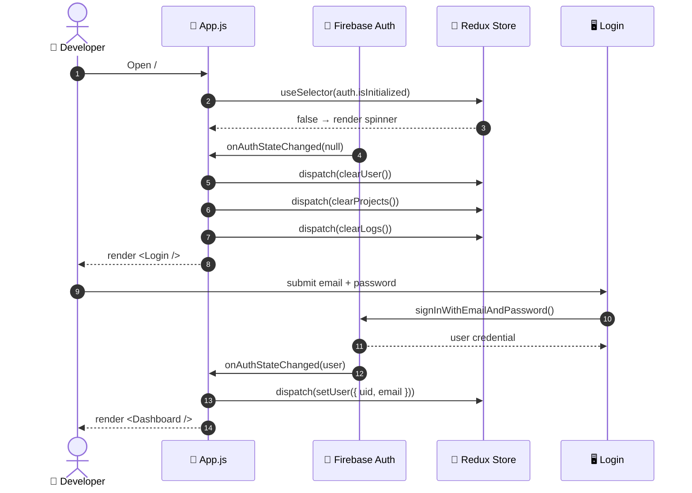
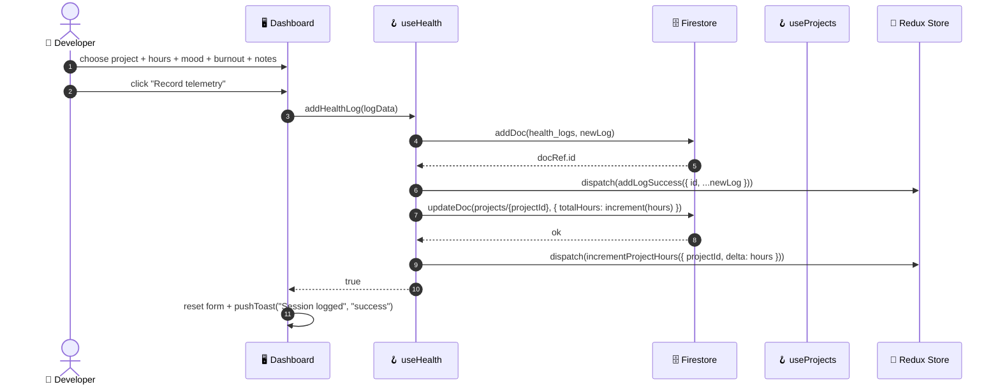
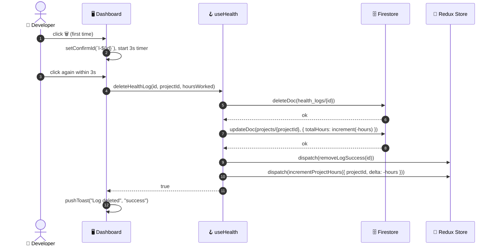
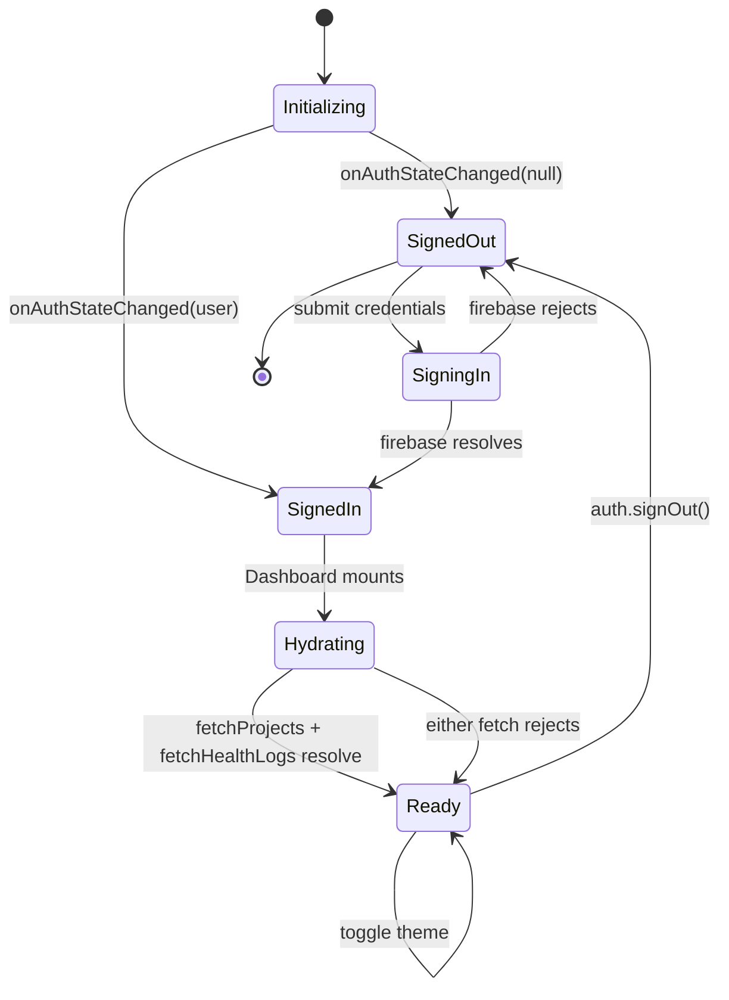
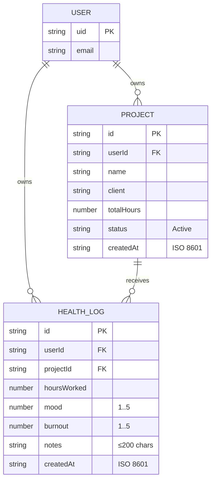
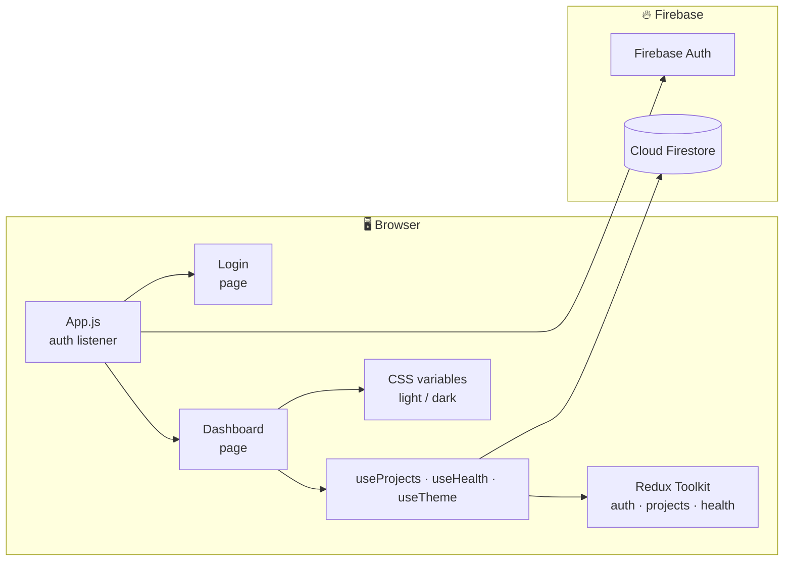
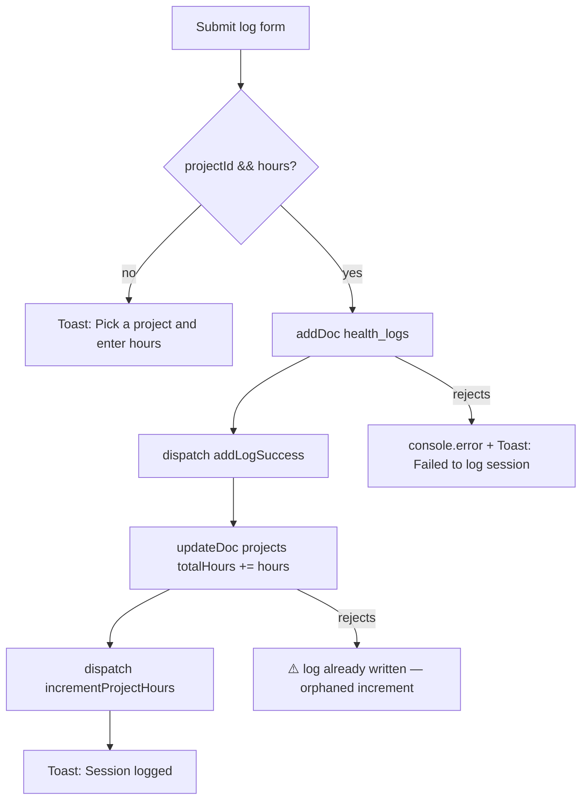

<div align="center">

# 🩺 DevPulse

### Developer health telemetry & project time tracking — in one dashboard

*An end-to-end specification of how a developer registers projects, logs work sessions against them, and watches hours, mood, and burnout trend over time — with Redux Toolkit driving client state and Firestore persisting the ledger.*

<br />


</div>

> **Module:** Dashboard (`/`) · **Primary Actor:** Developer / Engineer · **Trigger:** User signs in and lands on the dashboard
> **Related Modules:** Auth · Projects · Health Stream · Theme

---

## 📖 Contents

1. [Executive Summary](#1--executive-summary)
2. [Actors & Roles](#2--actors--roles)
3. [Preconditions](#3--preconditions)
4. [Main Success Scenario](#4--main-success-scenario)
5. [Postconditions](#5--postconditions)
6. [Exception & Alternative Flows](#6--exception--alternative-flows)
7. [Sequence Diagrams](#7--sequence-diagrams)
8. [State Machine](#8--state-machine)
9. [Business Rules](#9--business-rules)
10. [Data Contract](#10--data-contract)
11. [UI Reference](#11--ui-reference)
12. [Security & Authorization](#12--security--authorization)
13. [Observability — Toast Surface](#13--observability--toast-surface)
14. [Test Scenarios](#14--test-scenarios)
15. [Success Metrics](#15--success-metrics)
16. [User Guide](#16--user-guide)
17. [Technical Design](#17--technical-design)
18. [Roadmap & Known Risks](#18--roadmap--known-risks)

---

## 1 · Executive Summary

> **DevPulse** is a single-screen telemetry dashboard for developers. Every other module (Auth, Projects, Health Stream, Theme) exists to feed, filter, or frame this one view.

A developer signs in with email/password, registers their active projects, logs each work session against a project with **hours**, **mood (1–5)**, **burnout (1–5)**, and free-form notes. The dashboard aggregates these into four live stat cards — **Total hours**, **Projects**, **Avg mood (7d)**, **Avg burnout (7d)** — and keeps a searchable, sortable stream of every session.

- **Auth** is Firebase Auth. Session persistence is handled by `onAuthStateChanged` in `App.js`, which hydrates Redux on reload.
- **Projects & logs** live in two Firestore collections, keyed by `userId` and matched via a client-side map.
- **Hours flow upstream.** Logging a session atomically (client-side, best-effort) increments the parent project's `totalHours`; deleting a session decrements it.
- **Theme** is a `data-theme` attribute on `<html>`, persisted to `localStorage`, and switched from the header.

The flow targets a **sub-10-second log cadence** — capturing how a session *felt* while it's still fresh — and preserves auditability through timestamps and immutable Firestore document IDs.

### 🔑 Key Characteristics

| ⚡ Real-time | 🔒 Authenticated | 🧠 Derived stats | 🎨 Themeable |
|:---:|:---:|:---:|:---:|
| Redux mirrors the Firestore snapshot on every mutation | Every doc is scoped by `userId` | Stats memoized with `useMemo` | Light/dark via CSS variables |

---

## 2 · Actors & Roles

| Actor | Type | Responsibility |
|---|---|---|
| 👤 **Developer** | Primary | Signs in, registers projects, logs sessions, reviews trends, deletes entries. |
| ⚙️ **System** | Supporting | Hydrates Redux, computes stats, runs toast + confirm flows, invalidates nothing (Firestore is push-only). |
| 🔐 **Firebase Auth** | Supporting | Verifies credentials, issues a session, fires `onAuthStateChanged` events. |
| 🗄️ **Cloud Firestore** | Supporting | Stores `projects` and `health_logs` collections; scoped reads by `userId`. |
| 🎨 **Theme Controller** | Supporting | `useTheme` hook; sets `data-theme` on `<html>` and persists to `localStorage`. |
| 🌐 **Browser APIs** | Supporting | `navigator.clipboard` (email copy), `localStorage` (theme), `Intl` (date formatting). |

---

## 3 · Preconditions

| ✓ | Invariant | Verification |
|:---:|---|---|
| ✅ | **Firebase project configured** | `firebase-config.js` exports a valid `app`, `auth`, and `db` instance. |
| ✅ | **Auth listener attached** | `onAuthStateChanged` is subscribed in `App.js` and dispatches to `authSlice`. |
| ✅ | **Firestore rules allow user-scoped reads/writes** | Rules check `request.auth.uid == resource.data.userId` (see [§12](#12--security--authorization)). |
| ✅ | **Composite indexes present** | `health_logs(userId ASC, createdAt DESC)` and `projects(userId ASC, createdAt DESC)`. |
| ✅ | **Browser supports ES2020+** | `react-scripts@5` targets the browserslist in `package.json`. |

---

## 4 · Main Success Scenario

| # | Actor | Action |
|:---:|---|---|
| **1** | Developer | Opens the app at `/`. `App.js` mounts and shows the loading spinner until `isInitialized` is `true`. |
| **2** | System | `onAuthStateChanged` fires. If a session exists, dispatches `setUser`; otherwise `clearUser`. |
| **3** | Developer | *(No session)* Signs up or logs in on the `Login` screen. |
| **4** | System | Renders `<Dashboard />` with the resolved `user`. |
| **5** | System | `useProjects.fetchProjects()` and `useHealth.fetchHealthLogs()` fire in a single `useEffect`. |
| **6** | Developer | Fills **Project title** + **Client organization** and submits. |
| **7** | System | Writes a `projects` doc via `addDoc`, dispatches `addProjectSuccess`, fires a toast. |
| **8** | Developer | Selects the new project in **Target project**, enters hours, slides **Mood** and **Burnout**, adds notes. |
| **9** | System | Validates, writes a `health_logs` doc via `addDoc`, then `updateDoc` on the parent project with `increment(hours)`. |
| **10** | System | Dispatches `addLogSuccess` and `incrementProjectHours`, fires a success toast, resets the form. |
| **11** | Developer | (Optional) Searches, filters, and sorts the Projects list and Health stream. |
| **12** | Developer | (Optional) Deletes a project or a log with the two-tap confirmation. |
| **13** | System | *(Log delete)* Also decrements the parent project's `totalHours` by the log's hours. |
| **14** | Developer | (Optional) Toggles theme from the header; `data-theme` and `localStorage` update instantly. |
| **15** | Developer | Logs out. `signOut()` triggers `clearUser` + `clearProjects` + `clearLogs`. |

> **🎬 Outcome:** The dashboard is populated. Stats reflect the latest mutations. The developer sees an honest picture of their last week.

---

## 5 · Postconditions

| | State Change | Detail |
|:---:|---|---|
| 📁 | **Project document persisted** | `projects/{id}` exists with `userId = <operator>`, `totalHours = 0`, `status = "Active"`. |
| 📝 | **Session document persisted** | `health_logs/{id}` exists with the mood/burnout/hours/notes snapshot and an ISO `createdAt`. |
| 🔢 | **Parent project's `totalHours` updated** | Incremented via Firestore `increment(hours)` and mirrored in Redux via `incrementProjectHours`. |
| 🧠 | **Redux slices consistent** | `projects.items` and `health.logs` reflect the new server state without a refetch. |
| 🎨 | **Theme persisted** | `localStorage["devpulse-theme"]` holds `light` or `dark`; `<html data-theme>` matches. |
| 📡 | **Toast emitted** | `✓ Project registered` / `✓ Session logged` / `🗑 Project deleted` / `🗑 Log deleted`. |

---

## 6 · Exception & Alternative Flows

| Code | Condition | System Response |
|:---:|---|---|
| `A1` | Sign-up fails (weak password, email in use) | Toast-free inline error on `Login` — raw Firebase message, `Firebase: ` prefix stripped. |
| `A2` | Sign-in fails (wrong password) | Same as `A1`; `loading` resets; fields retained. |
| `A3` | Project form submitted with empty fields | Native `required` validation blocks the submit; no Firestore write occurs. |
| `A4` | Log submitted with no project selected or no hours | Client guard: toast `Pick a project and enter hours` (error), request aborted. |
| `A5` | Firestore write rejects (offline, rules) | Caught in the hook, `console.error`, toast `Failed to …` (error). **No rollback** — see [§18](#18--roadmap--known-risks). |
| `A6` | Search matches nothing in Projects | Empty state: `No projects match your search.` |
| `A7` | Search/filter matches nothing in Health | Empty state: `No logs match your filters.` |
| `A8` | User deletes a project that has logs | Project removed. Logs remain and render as **"Unknown project"** in the Health stream. |
| `A9` | User clicks delete once | Button flips to `Confirm?` and auto-reverts after 3s if not clicked again. |
| `A10` | `auth.signOut()` called | `onAuthStateChanged` fires with `null`; Redux is wiped; UI returns to `Login`. |
| `A11` | Email copy fails (insecure context) | Silently ignored — `navigator.clipboard` unavailable in non-HTTPS contexts. |
| `A12` | `createdAt` missing on a legacy doc | `timeAgo` returns `''`; the badge simply doesn't render. |

---

## 7 · Sequence Diagrams

### 7.1 · Bootstrap & Authentication



### 7.2 · Log a Session



### 7.3 · Delete a Log (with project rollback)



---

## 8 · State Machine



| State | Description | Dashboard Rendered |
|---|---|:---:|
| **Initializing** | `isInitialized = false`; loading spinner shown. | ❌ |
| **SignedOut** | `user === null`; `<Login />` mounted. | ❌ |
| **SigningIn** | Firebase auth in flight; submit button disabled. | ❌ |
| **SignedIn** | Redux `auth.user` populated. | ✅ |
| **Hydrating** | `projectStatus`/`healthStatus` are `loading`; skeletons render. | ✅ |
| **Ready** | Both collections fetched; interactive. | ✅ |

---

## 9 · Business Rules

| Rule | Specification |
|:---:|---|
| **BR-01** | A project **must** have a non-empty `name` and `client`, capped at 60 characters each. |
| **BR-02** | A log **must** reference an existing project and a positive `hoursWorked`. |
| **BR-03** | `hoursWorked` supports half-hour granularity (`step="0.5"`, `min="0.5"`). |
| **BR-04** | `mood` and `burnout` are integers in `[1, 5]`, driven by range inputs. |
| **BR-05** | `notes` is optional; maximum 200 characters. The character counter is live. |
| **BR-06** | Logging a session **always** increments its project's `totalHours` by `+hours`. |
| **BR-07** | Deleting a session **always** decrements its project's `totalHours` by `−hours`, clamped to `≥ 0` client-side. |
| **BR-08** | Deleting a project **never** cascades to its logs (see [A8](#6--exception--alternative-flows)). |
| **BR-09** | Stat card **Total hours** sums *every* log. **Avg mood** and **Avg burnout** only use the **7 most recent** logs. |
| **BR-10** | The email copy control writes `user.email` to the clipboard and shows `✓` for 1.5s. |
| **BR-11** | The theme is stored under the fixed key `devpulse-theme`. Unknown values are ignored. |
| **BR-12** | Toast messages auto-dismiss after **3200 ms**. |
| **BR-13** | Delete confirmation windows expire after **3000 ms**. |

> [!NOTE]
> **BR-09** is deliberate but easy to miss in the UI. The label says *"Avg mood (7d)"* — but the implementation is *the last 7 logs*, not *the last 7 calendar days*. If the developer logs 20 sessions in one day, the average covers only that day's tail.

---

## 10 · Data Contract

### Firestore Collections



> Firestore has no foreign keys — the diagram shows **logical** relations. The client enforces them by writing matching `userId` fields and by resolving `projectId` in a client-side map.

### Entity Shapes

**`projects` · CREATE**

```ts
{
  name: string,          // trimmed, required, ≤60 chars
  client: string,        // trimmed, required, ≤60 chars
  userId: string,        // from auth.user.uid
  totalHours: 0,
  status: "Active",
  createdAt: string      // new Date().toISOString()
}
```

**`health_logs` · CREATE**

```ts
{
  userId: string,
  projectId: string,
  hoursWorked: number,   // Number(logData.hoursWorked)
  mood: number,          // Number(logData.mood), clamped [1,5]
  burnout: number,       // Number(logData.burnout), clamped [1,5]
  notes: string,         // trimmed, ≤200 chars
  createdAt: string      // new Date().toISOString()
}
```

### Firestore Operations Involved

| Operation | Collection | Role in Flow |
|---|---|---|
| `addDoc` | `projects` | Register project |
| `getDocs` + `query` + `where` + `orderBy` | `projects` | Hydrate on dashboard mount |
| `deleteDoc` | `projects` | Remove project |
| `updateDoc` + `increment` | `projects` | Adjust `totalHours` on log add/delete |
| `addDoc` | `health_logs` | Record session |
| `getDocs` + `query` + `where` + `orderBy` | `health_logs` | Hydrate health stream |
| `deleteDoc` | `health_logs` | Remove session |

---

## 11 · UI Reference

```text
┌────────────────────────────────────────────────────────────────────────────┐
│  [DP]  DevPulse                                     [🌙]  [ Log out ]      │
│        Signed in as you@example.com 📋                                     │
├────────────────────────────────────────────────────────────────────────────┤
│  ┌────────────┐  ┌────────────┐  ┌────────────┐  ┌────────────┐            │
│  │ ⏱️  42.5   │  │ 📁  3      │  │ 🙂  4.2    │  │ 🔥  1.8    │            │
│  │ Total hrs  │  │ Projects   │  │ Avg mood   │  │ Avg burnout│            │
│  └────────────┘  └────────────┘  └────────────┘  └────────────┘            │
├────────────────────────────┬───────────────────────┬───────────────────────┤
│  ADD NEW PROJECT           │  TRACKED PROJECTS  ③  │  HEALTH STREAM     ⑦  │
│  ┌──────────────────────┐  │  ┌─────────────────┐  │  ┌─────────────────┐  │
│  │ Title: Inventory API │  │  │ 🔍 Search…      │  │  │ 🔍 Search notes…│  │
│  │ Client: Startup Inc  │  │  ├─────────────────┤  │  ├─────────────────┤  │
│  │ [ Register project ] │  │  │ ▎Inventory API  │  │  │ ▎Inventory API  │  │
│  └──────────────────────┘  │  │ ▎Startup Inc    │  │  │ ▎"shipped v1"   │  │
│                            │  │ 12.5 hrs Active │  │  │ 4 hrs 🙂4 🔥2   │  │
│  LOG A SESSION             │  ├─────────────────┤  │  ├─────────────────┤  │
│  ┌──────────────────────┐  │  │ ▎Design System  │  │  │ ▎Design System  │  │
│  │ Project: [ ▾       ] │  │  │ ▎Acme Co        │  │  │ ▎"burned out"   │  │
│  │ Hours:   [ 4.5     ] │  │  │ 30.0 hrs Active │  │  │ 8 hrs 😕2 🔥5   │  │
│  │ +1h +2h +4h +8h      │  │  └─────────────────┘  │  └─────────────────┘  │
│  │ Mood:    [====●===]  │  │                       │  [All projects ▾]     │
│  │ Burnout: [=●======]  │  │                       │  [Most recent  ▾]     │
│  │ Notes:   [........]  │  │                       │                       │
│  │ [ Record telemetry ] │  │                       │                       │
│  └──────────────────────┘  │                       │                       │
└────────────────────────────┴───────────────────────┴───────────────────────┘
                                                       ┌─────────────────────┐
                                                       │  ✓ Session logged   │
                                                       └─────────────────────┘
```

**Key UI affordances**

- Out-of-stock/empty states use centered illustrations (`📦`, `🌱`) and muted copy.
- Delete buttons morph into a red `Confirm?` pill for 3 seconds.
- Stats and lists are skeletonized while `status === 'loading'`.
- The whole layout collapses to a single column below **760px**, and to two columns below **1080px**.
- Theme is a **CSS-variable swap** on `<html data-theme>`; no layout shift, no flicker beyond the initial paint.

---

## 12 · Security & Authorization

| Concern | Current State | Recommended Hardening |
|---|---|---|
| **Auth provider** | Firebase Auth, email/password ✅ | None; solid. |
| **Session persistence** | `onAuthStateChanged` rehydrates Redux on reload ✅ | None. |
| **Firestore rules** | *Not shown in the repo* ⚠️ | Add explicit user-scoped rules (below). |
| **Client-side `userId`** | Written by the hook from `auth.user.uid` ⚠️ | Rules **must** validate `request.auth.uid == request.resource.data.userId` on create. |
| **Composite indexes** | Required for `where + orderBy` on `userId` ⚠️ | Commit `firestore.indexes.json` so deploys don't silently fail. |
| **Env vars** | Firebase config likely in `firebase-config.js` ⚠️ | Move to `.env.local` (`REACT_APP_FIREBASE_*`) — see [§17.4](#174--environment-variables). |
| **Serializable check** | Disabled globally in `store.js` ⚠️ | Justified only if you ever store `Timestamp` objects; the current model uses ISO strings, so it's unnecessarily broad. |

> [!IMPORTANT]
> **Firestore rules are the only real authorization boundary.** Everything else in the app assumes the client is honest. A minimal ruleset:

```js
rules_version = '2';
service cloud.firestore {
  match /databases/{database}/documents {

    match /projects/{projectId} {
      allow read, update, delete: if request.auth != null
                                   && request.auth.uid == resource.data.userId;
      allow create:            if request.auth != null
                                   && request.auth.uid == request.resource.data.userId;
    }

    match /health_logs/{logId} {
      allow read, update, delete: if request.auth != null
                                   && request.auth.uid == resource.data.userId;
      allow create:            if request.auth != null
                                   && request.auth.uid == request.resource.data.userId;
    }
  }
}
```

> [!WARNING]
> `totalHours` on the parent project can be mutated directly by any authenticated client that owns the project. If this value ever becomes user-facing *and* billable, back it with a Cloud Function and make the client write opaque.

---

## 13 · Observability — Toast Surface

Every meaningful user action emits a structured toast. Toasts live in `Dashboard` state and auto-dismiss after **3200 ms**.

| Event | Type | Message |
|---|:---:|---|
| Project created | `success` | `✓ Project registered` |
| Project creation failed | `error` | `⚠ Failed to register project` |
| Log created | `success` | `✓ Session logged` |
| Log creation failed | `error` | `⚠ Failed to log session` |
| Missing fields on log submit | `error` | `⚠ Pick a project and enter hours` |
| Project deleted | `success` | `✓ Project deleted` |
| Project deletion failed | `error` | `⚠ Failed to delete project` |
| Log deleted | `success` | `✓ Log deleted` |
| Log deletion failed | `error` | `⚠ Failed to delete log` |

**Observable surfaces**

- 🧾 **Toast stack** — bottom-right, `pointer-events: none`, max 320px wide.
- 🖱️ **`<title>` tooltip** — the delete button advertises the two-tap contract.
- 📋 **Clipboard feedback** — the email button flips its icon to `✓` for 1.5s.
- 💻 **`console.error`** — every rejected Firestore mutation logs the raw error.

---

## 14 · Test Scenarios

<details>
<summary><b>TC-01 · Bootstrap without a session</b></summary>

- **Given** no Firebase session
- **When** the app loads
- **Then** the loader shows briefly, `onAuthStateChanged` fires with `null`, and `<Login />` renders

</details>

<details>
<summary><b>TC-02 · Sign up and land on the dashboard</b></summary>

- **Given** a new email/password pair
- **When** the user submits the register form
- **Then** `createUserWithEmailAndPassword` resolves, `setUser` dispatches, and `<Dashboard />` mounts with the user's email visible

</details>

<details>
<summary><b>TC-03 · Register a project</b></summary>

- **Given** an authenticated user
- **When** they submit a title + client
- **Then** `addProjectSuccess` fires, the list increments, and the toast reads `✓ Project registered`

</details>

<details>
<summary><b>TC-04 · Log a session increments project hours</b></summary>

- **Given** a project with `totalHours = 12.5`
- **When** a 4.5-hour log is recorded
- **Then** Firestore's `totalHours` becomes 17.0 and the Redux mirror reflects the same value without a refetch

</details>

<details>
<summary><b>TC-05 · Delete a log decrements project hours</b></summary>

- **Given** a 4.5-hour log on a project with `totalHours = 17.0`
- **When** the log is deleted via the two-tap confirm
- **Then** `totalHours` returns to 12.5 and the log disappears from the health stream

</details>

<details>
<summary><b>TC-06 · Confirm-delete expires</b></summary>

- **Given** a visible delete button
- **When** the user clicks once and waits > 3 seconds
- **Then** the button reverts to 🗑 and no Firestore call is made

</details>

<details>
<summary><b>TC-07 · Orphaned logs survive project deletion (A8)</b></summary>

- **Given** a project with 3 logs
- **When** the project is deleted
- **Then** the logs remain in the stream and render as **"Unknown project"**

</details>

<details>
<summary><b>TC-08 · Search & sort the health stream</b></summary>

- **Given** ≥ 3 logs across two projects
- **When** the user sorts by *Most hours*
- **Then** the log with the largest `hoursWorked` appears first, regardless of `createdAt`

</details>

<details>
<summary><b>TC-09 · Theme persists across reloads</b></summary>

- **Given** the user toggled to dark mode
- **When** the page is reloaded
- **Then** `<html data-theme="dark">` is applied before first paint and the toggle shows ☀️

</details>

<details>
<summary><b>TC-10 · Logout wipes all state</b></summary>

- **Given** a populated dashboard
- **When** the user clicks **Log out**
- **Then** `clearUser`, `clearProjects`, and `clearLogs` dispatch, and `<Login />` renders with empty Redux state

</details>

---

## 15 · Success Metrics

| Metric | Target | Why It Matters |
|---|---|---|
| ⏱️ **Median session log time** | `< 10s` | Capture how the session *felt* while it's fresh |
| 📊 **Dashboard hydration time** | `< 1.5s` p95 | On a warm Firestore connection |
| 🔁 **Mutation success rate** | `> 99%` | Firestore + client happy path |
| 🧮 **Hours drift** | `0.0` hours | Redux mirror must match Firestore exactly |
| 🧹 **Orphaned log ratio** | `< 5%` of logs | A8 is a UX hazard; keep it rare |
| 🎨 **Theme stability** | `0` flashes on reload | `localStorage` read must precede paint |

---

## 16 · User Guide

> **Audience:** Developers using DevPulse to track their own work.
> **Goal:** Log a session in under 10 seconds, and review trends honestly.

### 16.1 · Quick Start

1. **Register** or **log in** with email + password (≥ 6 characters).
2. **Register a project** — a short title and a client name.
3. **Log a session** — pick the project, enter hours, slide mood & burnout, add notes.
4. **Watch the stat cards** update in real time.
5. **Filter and sort** the health stream when you want to see patterns.

### 16.2 · Know Your Screen

| Area | Where | What it does |
|---|---|---|
| **Brand / email** | Top left | Click your email to copy it to the clipboard. |
| **Theme toggle** | Top right | Swap between 🌙 and ☀️. Persists across reloads. |
| **Log out** | Top right | Ends the session and clears all client state. |
| **Stat cards** | Below header | Total hours, project count, 7-day average mood and burnout. |
| **Add new project** | Left column | Register a project with a title and client. |
| **Log a session** | Left column | Hours, mood, burnout, notes. Quick-add buttons: +1h, +2h, +4h, +8h. |
| **Tracked projects** | Middle column | Searchable list with hours, status, and per-row delete. |
| **Health stream** | Right column | Searchable, filterable, sortable log of every session. |

### 16.3 · Logging a Session

- **Project** — pick from the dropdown. Logs cannot exist without a project.
- **Hours** — decimal input with half-hour granularity. Use the quick-add buttons to avoid typing.
- **Mood (1–5)** — slider with live emoji: 😞 😕 😐 🙂 😄
- **Burnout (1–5)** — slider with live emoji: 🧘 😌 😬 😰 🔥
- **Notes** — optional, 200-character cap, with a live counter.

When you press **Record telemetry**, DevPulse writes the log and increments the project's hours in one motion.

### 16.4 · Filtering & Sorting

| Control | Effect |
|---|---|
| Health search | Substring match against notes **and** project name. |
| Project filter | Restricts to a single project. |
| Sort | `Most recent` · `Most hours` · `Best mood` · `Highest burnout`. |
| Projects search | Substring match against title and client. |

### 16.5 · Deleting Safely

All delete buttons use a **two-tap confirm**:

1. First click → the button turns red and reads **Confirm?**.
2. Second click within **3 seconds** → the item is deleted.
3. Do nothing → the button reverts and nothing happens.

Deleting a log **also** decrements its project's hours. Deleting a **project** does **not** delete its logs — they'll render as **"Unknown project"** in the stream.

### 16.6 · Troubleshooting

| What you see | Likely reason | What to do |
|---|---|---|
| Spinner never resolves | Firebase config invalid | Check `firebase-config.js` / `.env.local`. |
| Empty dashboard after login | Firestore returned no docs for your `uid` | Verify the composite index exists. |
| `Failed to log session` toast | Firestore rules rejected the write | Confirm `request.auth.uid == userId` in rules. |
| Hours don't update | `updateDoc` on the parent project failed | Open the console; the error is logged. |
| Logs show `Unknown project` | The parent project was deleted (A8) | Expected. Delete the logs manually or restore the project. |
| Clipboard copy does nothing | Non-HTTPS context | Use `https://` or `localhost`. |

### 16.7 · FAQ

**Can I log a session without a project?**
No. Pick a project first — the client blocks the submit.

**What does "Avg mood (7d)" mean exactly?**
The average mood over your **last 7 logs**, not the last 7 calendar days (BR-09).

**Is my data shared?**
No. Every document is scoped to your `uid`.

**Can I bulk-import logs?**
Not currently. See the [Roadmap](#18--roadmap--known-risks).

**What happens to my hours if I delete a project?**
The project's `totalHours` is lost with the document. Its logs remain, but they no longer contribute to a project's counter.

### 16.8 · Glossary

| Term | Meaning |
|---|---|
| **Session** | A single `health_logs` entry with hours, mood, burnout, notes. |
| **Telemetry** | The app's internal name for a logged session. |
| **Mirror** | The Redux copy of a Firestore document. |
| **Orphaned log** | A log whose parent project no longer exists. |
| **Burnout (1–5)** | 1 = recharged, 5 = fried. |

---

## 17 · Technical Design

> **Purpose:** Bridge the requirements above and the code. This section maps the architecture, component tree, and proposed hardening work.

### 17.1 · Goals & Non-Goals

| Goals | Non-Goals |
|---|---|
| Deterministic, memoized derived stats | Multi-tenant teams / orgs |
| Optimistic Redux mirror of every write | Offline sync (`enableIndexedDbPersistence`) |
| Composable custom hooks per domain | Server-side rendering |
| Zero-dependency theming via CSS variables | Charting / time-series visualizations |
| Atomic "log + increment" (see 🟡) | Migrating off `react-scripts` to Vite |

### 17.2 · Architecture Overview



| Layer | Technology | Responsibility |
|---|---|---|
| **Presentation** | React 19 (CRA 5) | Pages, forms, lists, toasts |
| **Client state** | Redux Toolkit 2 | Single source of truth for auth + collections |
| **Domain logic** | Custom hooks | Firestore I/O, form validation, side-effects |
| **Auth** | Firebase Auth 12 | Session lifecycle |
| **Persistence** | Cloud Firestore | `projects`, `health_logs` |
| **Styling** | Plain CSS + CSS variables | Theming, layout, responsive breakpoints |

### 17.3 · Project Structure

```text
src/
├── App.js                     # Auth listener + route gate
├── App.css                    # Loader spinner styles
├── index.js                   # React root + <Provider store>
├── index.css                  # CSS variables, resets, scrollbars, sliders
├── config/
│   └── firebase-config.js     # exports { app, auth, db }
├── features/
│   ├── authSlice.js           # user · status · isInitialized
│   ├── projectsSlice.js       # items · status · error
│   └── healthSlice.js         # logs · status · error
├── hooks/
│   ├── useProjects.js         # addProject · fetchProjects · deleteProject
│   ├── useHealth.js           # addHealthLog · fetchHealthLogs · deleteHealthLog
│   └── useTheme.js            # theme · toggleTheme
├── pages/
│   ├── dashboard/
│   │   ├── dashboard.js
│   │   └── dashboard.css
│   └── login/
│       ├── login.js
│       └── login.css
└── store/
    └── store.js               # configureStore with 3 reducers
```

### 17.4 · Environment Variables

Move the Firebase config out of the repo before this ever ships:

```bash
# .env.local
REACT_APP_FIREBASE_API_KEY=...
REACT_APP_FIREBASE_AUTH_DOMAIN=...
REACT_APP_FIREBASE_PROJECT_ID=...
REACT_APP_FIREBASE_STORAGE_BUCKET=...
REACT_APP_FIREBASE_MESSAGING_SENDER_ID=...
REACT_APP_FIREBASE_APP_ID=...
```

```js
// src/config/firebase-config.js
import { initializeApp } from 'firebase/app';
import { getAuth } from 'firebase/auth';
import { getFirestore } from 'firebase/firestore';

const app  = initializeApp({
  apiKey:            process.env.REACT_APP_FIREBASE_API_KEY,
  authDomain:        process.env.REACT_APP_FIREBASE_AUTH_DOMAIN,
  projectId:         process.env.REACT_APP_FIREBASE_PROJECT_ID,
  storageBucket:     process.env.REACT_APP_FIREBASE_STORAGE_BUCKET,
  messagingSenderId: process.env.REACT_APP_FIREBASE_MESSAGING_SENDER_ID,
  appId:             process.env.REACT_APP_FIREBASE_APP_ID,
});

export const auth = getAuth(app);
export const db   = getFirestore(app);
export default app;
```

### 17.5 · State Shape

```ts
{
  auth: {
    user: { uid: string; email: string } | null,
    status: 'idle' | 'succeeded',
    isInitialized: boolean,
  },
  projects: {
    items: Project[],
    status: 'idle' | 'loading' | 'succeeded' | 'failed',
    error: string | null,
  },
  health: {
    logs: HealthLog[],
    status: 'idle' | 'loading' | 'succeeded' | 'failed',
    error: string | null,
  },
}
```

### 17.6 · Data Flow — Log a Session



### 17.7 · Key Design Decisions & Trade-offs

| # | Decision | Rationale | Trade-off |
|---|---|---|---|
| **D1** | Firestore is the source of truth; Redux mirrors it | Simpler reads across the tree | Two sources can drift on partial failure |
| **D2** | Custom hooks own all Firestore I/O | Pages stay declarative | Business logic is distributed across 3 hooks |
| **D3** | `userId` written from `auth.user.uid` | Rules can scope by `uid` | Client must be trusted to send it |
| **D4** | ISO strings for `createdAt` | Sortable without server timestamps | No server-authoritative clock |
| **D5** | `serializableCheck: false` | Legacy choice (see note) | Disables a valuable safety net |
| **D6** | Two-tap delete instead of a modal | Zero dependencies, keyboard-friendly | Not obvious to first-time users |
| **D7** | CSS variables for theme | Instant swap, zero re-render | All colors must be declared as variables |

### 17.8 · Testing Strategy

| Level | Scope | Tools (suggested) |
|---|---|---|
| **Unit — reducers** | `setUser`, `clearUser`, `addLogSuccess`, `incrementProjectHours` clamping | Vitest |
| **Unit — hooks** | `useHealth.addHealthLog` with a mocked Firestore SDK | Vitest + `firebase-mock` |
| **Component** | Confirm-delete timer, character counter, empty states | React Testing Library |
| **Integration** | Full login → add project → log session against the Firestore emulator | `@firebase/rules-unit-testing` |
| **E2E** | TC-01 → TC-10 | Playwright |
| **Rules** | Reject cross-user reads/writes | `@firebase/rules-unit-testing` |

### 17.9 · Performance Notes

- **Hydration:** Two parallel `getDocs` calls fire in a single `useEffect`. On a cold cache, budget ~600–900ms.
- **Rendering:** `filteredProjects`, `filteredLogs`, `stats`, and `projectMap` are all `useMemo`-guarded. Sorting is client-side — fine up to a few thousand logs, then move to a `useVirtualizer`.
- **Bundle:** `firebase@12` is the dominant dependency (~250KB gzipped). Tree-shaking already applies via named imports.
- **Paint:** Theme is set synchronously in the `useTheme` `useState` initializer, so the swap happens before the first effect runs.

---

## 18 · Roadmap & Known Risks

### 18.1 · Known Issues

| ID | Issue | Impact | Mitigation |
|---|---|---|---|
| **R1** | `addHealthLog` is non-atomic (log → increment). | Orphaned increments if the second write fails | Wrap in a Cloud Function or `runTransaction` |
| **R2** | `deleteHealthLog` is non-atomic (delete → decrement). | Negative drift if the second write fails | Same as R1 |
| **R3** | `deleteProject` does not cascade. | Orphaned logs render as "Unknown project" | Cascade in a Cloud Function, or add a `projectSnapshot` field on logs |
| **R4** | Firestore rules are not committed. | Deploy has no code review of security surface | Commit `firestore.rules` + `firestore.indexes.json` |
| **R5** | Firebase config lives in `src/config/firebase-config.js`. | API key in the repo | Move to `.env.local` (see [§17.4](#174--environment-variables)) |
| **R6** | `serializableCheck: false` is global. | Disables Redux's dev safety net | Scope it or replace it with an allow-list |
| **R7** | "Avg mood (7d)" means *last 7 logs*, not *last 7 days*. | Misleading label | Rename the label, or compute against `createdAt` |
| **R8** | No optimistic UI on Firestore failures. | A failed write leaves Redux clean but the user confused | Add per-write rollback in the hooks |
| **R9** | CRA 5 is deprecated. | No upstream security patches | Migrate to Vite |
| **R10** | Delete confirm has no keyboard escape. | Accessibility gap | Bind `Escape` to cancel the pending confirm |

### 18.2 · Roadmap

- [ ] **Atomic log + increment** via a Firestore `runTransaction` or Cloud Function (R1, R2).
- [ ] **Cascade delete** for projects (R3) — or snapshot the project name into each log.
- [ ] **Firestore rules + indexes** committed to the repo (R4).
- [ ] **Environment variable** migration (R5).
- [ ] **Rename "7d"** or fix the metric (R7).
- [ ] **Export to CSV / JSON** for personal archives.
- [ ] **Charts** — mood & burnout as a sparkline above the health stream.
- [ ] **Weekly digest** email via a scheduled Cloud Function.
- [ ] **Team mode** — share projects with collaborators via `members[]`.
- [ ] **Vite migration** (R9).

### 18.3 · Open Questions

- Should **`totalHours` be derived** from logs on read, instead of stored and mutated?
- Should logs survive a project deletion, or should the delete be a soft-archive?
- Should the app use **server timestamps** instead of client `toISOString()`?
- Is **mood/burnout** the right abstraction, or should there be configurable dimensions?
- Should DevPulse ship a **PWA** wrapper for offline logging?

---

<div align="center">

### 🔗 Related Files

[`authSlice.js`](./src/features/authSlice.js) · [`projectsSlice.js`](./src/features/projectsSlice.js) · [`healthSlice.js`](./src/features/healthSlice.js) · [`useProjects.js`](./src/hooks/useProjects.js) · [`useHealth.js`](./src/hooks/useHealth.js) · [`useTheme.js`](./src/hooks/useTheme.js)

<br />

**DevPulse · Developer Health Telemetry**

<sub>Specification · `v1.0` · Generated 2025</sub>

<sub>⚡ React 19 · Redux Toolkit · Firebase · Firestore · CRA 5</sub>

</div>
